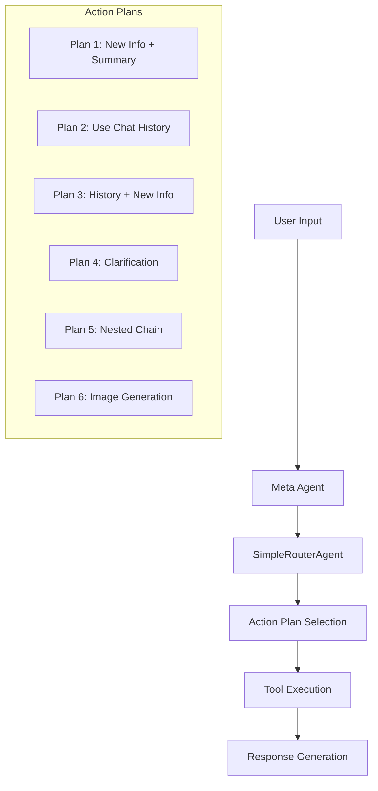
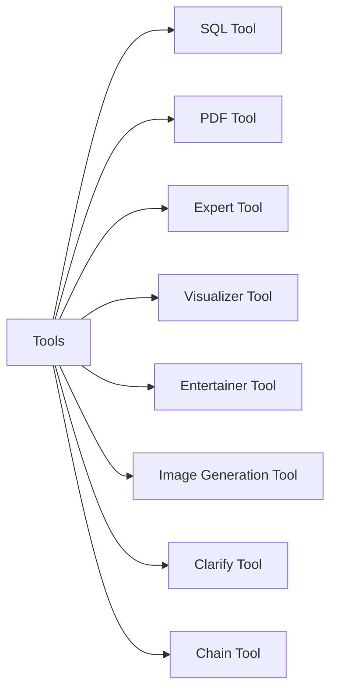
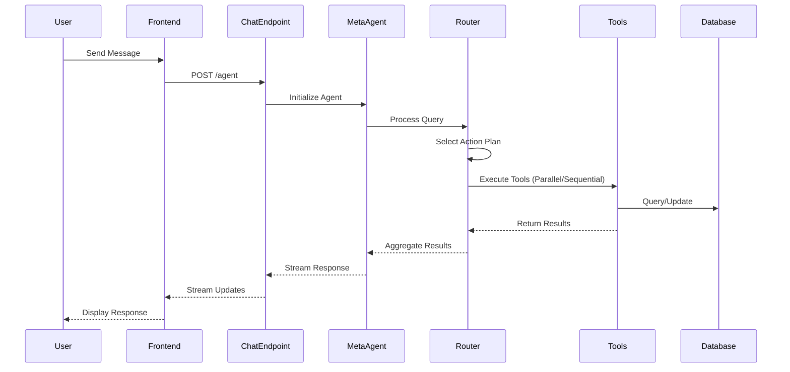

# AgentKit Technical Architecture

## Overview

AgentKit is a LangChain-based framework for building reliable Agent applications. The system uses a unique Meta Agent architecture with predefined Action Plans to ensure reliable and predictable agent behavior.

## Core Components

### 1. Meta Agent Architecture



#### SimpleRouterAgent Implementation

The SimpleRouterAgent is responsible for:

1. Selecting appropriate action plans based on user input
2. Managing the execution flow of tools
3. Handling parallel and sequential tool execution
4. Processing intermediate results
5. Generating final responses

Key features:

- Async execution support
- Error handling and retries
- Conversation history management
- Streaming response capability

#### Action Plans

1. **Plan 1**: Gather new information and summarize
   - Uses PDF and entertainer tools in parallel
   - Followed by expert tool
2. **Plan 2**: Use existing chat history
   - Uses memory and expert tool
3. **Plan 3**: Combine history with new information
   - Uses memory and PDF tool
   - Followed by expert tool
4. **Plan 4**: Request clarification
   - Uses clarify tool for ambiguous questions
5. **Plan 5**: Nested chain for complex queries
   - Uses chain tool for multi-step reasoning
6. **Plan 6**: Generate images
   - Uses image generation tool

### 2. Tool System



#### Available Tools

- **SQL Tool**: Queries a database
  - Supports complex SQL queries
  - Handles data visualization requests
  - Includes query validation
- **PDF Tool**: Processes document information
  - Extracts text from PDFs
  - Handles document summarization
  - Supports context-aware queries
- **Expert Tool**: Provides domain expertise
  - Contextual response generation
  - Integration with chat history
  - Markdown formatting support
- **Visualizer Tool**: Creates data visualizations
  - Recharts integration
  - Multiple chart types support
  - Dynamic data handling
- **Entertainer Tool**: Generates preliminary responses
  - Quick initial responses
  - Engaging content generation
  - Progress indication
- **Image Generation Tool**: Creates images from descriptions
  - Prompt optimization
  - Style consistency
  - Error handling
- **Clarify Tool**: Handles ambiguous queries
  - User interaction management
  - Context refinement
  - Clear prompt generation
- **Chain Tool**: Manages nested operations
  - Multi-step reasoning
  - Sub-task coordination
  - Result aggregation

### 3. Message Flow and Processing



### 4. Data Models

#### Message Schema

```typescript
interface ChatMessage {
    role: "system" | "user" | "agent"
    content: string
    conversation_id: UUID
    message_id: UUID
}

interface ChatQuery {
    messages: ChatMessage[]
    api_key?: string
    org_id?: string
    anthropic_api_key?: string
    gemini_api_key?: string
    model: string
    conversation_id: UUID
    new_message_id: UUID
    user_email: string
    settings?: UserSettings
}

interface UserSettings {
    data: Record<string, any>
    version?: number
}
```

### 5. Frontend Architecture

The frontend is built with Next.js and uses:

- Zustand for state management
- TypeScript for type safety
- Tailwind CSS for styling
- WebSocket for real-time updates

Key frontend components:

- Chat interface
- Tool output renderers
- Settings management
- Authentication handling

### 6. Backend Architecture

The backend uses FastAPI and includes:

- Async request handling
- Streaming responses
- LangChain integration
- Multiple LLM provider support (OpenAI, Anthropic, Gemini)

#### LLM Integration

```python
def get_llm(model: str, api_key: str) -> BaseLanguageModel:
    """
    Factory function to create LLM instances based on model type:
    - OpenAI models (gpt-4, gpt-3.5-turbo)
    - Anthropic models (claude)
    - Google models (gemini)
    """
```

## Security Features

1. **Authentication**
   - JWT-based authentication
   - API key management
   - Role-based access control

2. **Data Protection**
   - Secure message handling
   - API key encryption
   - Environment variable protection

## Development Setup

### Local Development

```bash
# Backend
cd backend
poetry install
poetry run uvicorn app.main:app --reload

# Frontend
cd frontend
pnpm install
pnpm dev
```

### Docker Deployment

```bash
docker-compose up -d
```

## Integration Points

### External Services

- LLM Providers (OpenAI, Anthropic, Gemini)
- Database systems
- Authentication services

### API Endpoints

#### Chat Endpoint

```typescript
POST /api/v1/chat/agent
{
    messages: ChatMessage[]
    model: string
    conversation_id: UUID
    new_message_id: UUID
    user_email: string
    settings?: UserSettings
}
```

#### Feedback Endpoint

```typescript
POST /api/v1/chat/feedback
{
    conversation_id: UUID
    message_id: UUID
    user: string
    score: number
    comment: string
    key: string
}
```

## Best Practices

1. **Error Handling**
   - Comprehensive error catching
   - Graceful degradation
   - User-friendly error messages

2. **Performance**
   - Async operations
   - Response streaming
   - Efficient database queries

3. **Code Organization**
   - Clear module structure
   - Dependency injection
   - Type safety

## Monitoring and Maintenance

1. **Logging**
   - Detailed error logging
   - Performance metrics
   - User interaction tracking

2. **Updates**
   - Regular dependency updates
   - Security patches
   - Feature additions

.
├── .env.example
├── .env
├── .pre-commit-config.yaml
├── Makefile
├── docker-compose.yml
├── docker-compose-dev.yml
├── docker-compose-demo.yml
│
├── backend/
│   ├── Dockerfile
│   └── app/
│       ├── .env.test
│       ├── .pylintrc
│       ├── pyproject.toml
│       ├── setup.cfg
│       │
│       ├── alembic/
│       │   ├── env.py
│       │   ├── README
│       │   ├── script.py.mako
│       │   └── versions/
│       │
│       └── app/
│           ├── **init**.py
│           │
│           ├── api/
│           │   ├── **init**.py
│           │   ├── deps.py
│           │   └── v1/
│           │       ├── **init**.py
│           │       ├── api.py
│           │       └── endpoints/
│           │           ├── chat.py
│           │           ├── sql.py
│           │           └── statistics.py
│           │
│           ├── core/
│           │   ├── **init**.py
│           │   ├── config.py
│           │   ├── security.py
│           │   └── fastapi.py
│           │
│           ├── db/
│           │   ├── **init**.py
│           │   ├── session.py
│           │   ├── base.py
│           │   ├── base_class.py
│           │   ├── bigquery_database.py
│           │   └── SQLDatabaseExtended.py
│           │
│           ├── models/
│           │   ├── **init**.py
│           │   ├── auth_model.py
│           │   ├── base_uuid_model.py
│           │   ├── chat_model.py
│           │   └── user_model.py
│           │
│           ├── schemas/
│           │   ├── **init**.py
│           │   ├── agent_schema.py
│           │   ├── auth_schema.py
│           │   ├── chat_schema.py
│           │   ├── ingestion_schema.py
│           │   ├── message_schema.py
│           │   ├── streaming_schema.py
│           │   └── tool_schemas/
│           │       ├── **init**.py
│           │       ├── sql_tool_schema.py
│           │       └── ga4_tool_schema.py
│           │
│           ├── services/
│           │   ├── **init**.py
│           │   ├── auth/
│           │   │   ├── **init**.py
│           │   │   └── jwt.py
│           │   └── chat_agent/
│           │       ├── **init**.py
│           │       ├── agent.py
│           │       ├── helpers/
│           │       │   ├── llm.py
│           │       │   └── query_formatting.py
│           │       └── tools/
│           │           ├── ExtendedBaseTool.py
│           │           └── library/
│           │               ├── sql_tool/
│           │               │   └── sql_tool.py
│           │               └── ga4_tool/
│           │                   └── ga4_tool.py
│           │
│           ├── utils/
│           │   ├── **init**.py
│           │   ├── config.py
│           │   ├── uuid6.py
│           │   ├── uuid_.py
│           │   ├── sql.py
│           │   └── streaming/
│           │       ├── **init**.py
│           │       └── stream.py
│           │
│           └── main.py
│
├── frontend/
│   ├── Dockerfile
│   ├── .dockerignore
│   ├── .env.example
│   ├── .env
│   ├── .eslintignore
│   ├── .eslintrc.js
│   ├── .gitignore
│   ├── package.json
│   ├── pnpm-lock.yaml
│   ├── next.config.js
│   ├── tailwind.config.js
│   ├── tsconfig.json
│   │
│   ├── .husky/
│   │   ├── commit-msg
│   │   ├── pre-commit
│   │   └── pre-push
│   │
│   └── src/
│       ├── components/
│       │   ├── Chat/
│       │   │   ├── ChatInput.tsx
│       │   │   └── ChatMessage.tsx
│       │   └── CustomIcons/
│       │       ├── Icon.tsx
│       │       └── ThreeDotsLoader.tsx
│       │
│       ├── hooks/
│       │   └── useChat.ts
│       │
│       ├── pages/
│       │   ├──_app.tsx
│       │   ├── api/
│       │   │   └── auth/
│       │   │       └── [...nextauth].ts
│       │   └── index.tsx
│       │
│       ├── styles/
│       │   └── globals.css
│       │
│       └── utils/
│           └── tree.tsx
│
├── caddy/
│   └── Caddyfile
│
├── scripts/
│   ├── 1-create-dbs.sql
│   └── sql_db_tool/
│       └── 2-chinook_psql_load.sql
│
└── README.md
